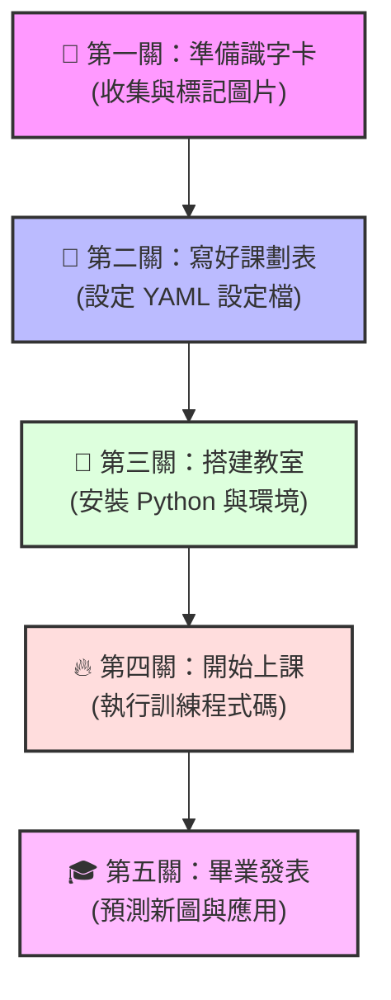

# 🎯 YOLO 🚀 訓練全流程小白通關指南

你好！如果你對人工智慧（AI）、深度學習完全沒有背景，看到一堆程式碼和專有名詞覺得頭很大，**請完全不用擔心！** 

這份指南是專門為**「完全零基礎」**的初學者設計的。我們會用最生動的比喻、最直覺的圖解，手把手帶你走過一遍 YOLO 模型訓練的完整流程。

---

## 💡 核心比喻：什麼是 YOLO 訓練？

想像你要教一個**剛出生的小寶寶（AI 模型）**學會認出什麼是「貓咪」和「狗狗」：
1. **識字卡（資料集）**：你需要準備幾百張有貓和狗的照片。
2. **畫紅圈寫答案（標記 Label）**：你在照片中用紅筆把貓和狗框起來，並在旁邊寫上「這是貓」、「這是狗」。
3. **上課（訓練 Training）**：你把這些卡片一次又一次地拿給寶寶看。
4. **小考（驗證 Validation）**：你拿一些寶寶**沒看過**的貓狗照片考他，看他能不能自己框出來。
5. **打手心（損失值 Loss）**：寶寶猜錯了，就給予修正（痛感就是 Loss，學得越好，痛感越低）。
6. **畢業證書（權重檔 `.pt`）**：寶寶終於學會了，他的大腦記憶體（`best.pt` 檔案）就是你最後的成果！

---

## 🗺️ YOLO 訓練的五大黃金步驟



---

## 🎒 第一關：準備識字卡（收集與標記資料）

這是整個 AI 訓練中**最關鍵、最花時間**的一步（佔了 80% 的工作量）。AI 聰不聰明，完全取決於你給他的教材好不好！

### 1. 收集圖片 (Images)
* **數量**：每個要辨識的物體，建議至少準備 **100 ~ 500 張** 照片（越多越好）。
* **多樣性**：照片要在不同的光線（白天、晚上）、不同的角度（正面、側面）、不同的背景下拍攝，AI 才不會「死背」。

### 2. 標記圖片 (Labeling)
你必須告訴 AI 物體在圖片的哪個位置。我們通常會使用免費的標記工具（例如：[Roboflow](https://roboflow.com/)、[CVAT](https://www.cvat.ai/) 或本地的 `LabelImg`）。

在工具中，你會在物體上「畫框框」，工具會自動幫每一張照片產生一個**同名的 `.txt` 文字檔**（這就是答案標籤）。

> **💡 YOLO 標籤格式小秘密**
>
> 假設有一張貓的照片 `cat_01.jpg`，標記後會產生 `cat_01.txt`。打開它會看到類似這樣的數字：
> ```text
> 0 0.512 0.384 0.224 0.352
> ```
> 這些數字代表：
> * `0`：類別代號（例如 0 代表貓，1 代表狗）。
> * `0.512`：框框中心的 X 座標（比例值，0~1 之間）。
> * `0.384`：框框中心的 Y 座標。
> * `0.224`：框框的寬度。
> * `0.352`：框框的高度。

---

## 📝 第二關：寫好課劃表（設定 YAML 檔）

我們需要把「圖片」和「答案」整理成固定的資料夾結構，並寫一張「說明書（YAML 檔）」告訴 YOLO 去哪裡讀取這些教材。

### 1. 標準資料夾結構
請在你的 D 槽專案目錄下，建立如下的結構：
```text
my_dataset/
├── images/             # 放所有圖片的資料夾
│   ├── train/          # 訓練組圖片（上課用，例如 80% 的圖片）
│   └── val/            # 驗證組圖片（小考用，例如 20% 的圖片）
└── labels/             # 放所有 .txt 答案檔的資料夾
    ├── train/          # 訓練組答案（必須跟 train 圖片檔名完全對應！）
    └── val/            # 驗證組答案（必須跟 val 圖片檔名完全對應！）
```

### 2. 撰寫 `data.yaml` 設定檔
在專案根目錄建立一個名為 `data.yaml` 的檔案，內容如下：
```yaml
# 告訴 YOLO 資料集在哪裡
path: D:/MyDesktop/antigravity2.0/yolo_db/my_dataset  # 資料集的絕對路徑
train: images/train  # 訓練圖片相對於 path 的路徑
val: images/val      # 驗證圖片相對於 path 的路徑

# 告訴 YOLO 有哪些東西要認，以及它們的名字
nc: 2                # 類別的總數量 (Number of Classes)，這裡有貓和狗，所以是 2
names:               # 類別的名稱對照表
  0: cat             # 0 號是貓咪
  1: dog             # 1 號是狗狗
```

---

## 🏫 第三關：搭建教室（安裝 Python 與環境）

你的電腦需要安裝一些軟體，才能讓 AI 跑起來。

1. **安裝 Python**：這是執行程式碼的基礎環境（建議安裝 Python 3.10 或 3.11）。
2. **安裝 PyTorch**：這是 AI 計算的核心引擎。如果你有 Nvidia 顯示卡（例如 GTX 1650, RTX 3060 等），可以安裝支援 GPU（CUDA）的版本，訓練速度會快上數十倍！
3. **一鍵安裝 YOLO 套件**：
   開啟你的終端機（Command Prompt 或 PowerShell），輸入這行指令：
   ```bash
   pip install ultralytics
   ```
   *註：`ultralytics` 是目前全世界最流行、功能最完整的官方 YOLO 維護套件。*

---

## 🔥 第四關：開始上課（執行訓練程式碼）

一切準備就緒！接下來我們要寫一小段 Python 程式，請 AI 開始學習。

### 1. 選擇你的「學生」（模型大小）
YOLO 提供了不同智商與體型的「學生」供你選擇：
* **YOLO11n (Nano)**：體積最小、速度最快，適合配備一般或低顯存顯卡（例如 GTX 1650 4GB）的電腦。
* **YOLO11s (Small)**：稍微大一點，精準度更好。
* **YOLO11m (Medium) / YOLO11l (Large)**：更聰明，但需要非常強大的顯卡才能訓練。
> [!TIP]
> 第一次嘗試，**強烈建議選擇 `yolo11n.pt`**，不僅速度快，也最不容易發生電腦當機或顯存不足的問題！

### 2. 撰寫訓練腳本 `train.py`
在專案目錄下建立 `train.py`，貼上以下程式碼：

```python
from ultralytics import YOLO

def start_training():
    # 1. 載入預訓練模型（就像載入一個有基本視覺能力的「大學生」模型）
    model = YOLO("yolo11n.pt") 

    # 2. 開始訓練（讓他針對你的課本進行學習）
    model.train(
        data="data.yaml",     # 課劃表路徑
        epochs=100,           # 整套教材重複看 100 遍（輪次）
        imgsz=640,            # 所有圖片會被自動縮放成 640x640 進行訓練
        batch=16,             # 每次塞 16 張圖片給 AI 學習（如果顯卡太差，可以調成 8 或 4）
        device=0,             # 指定使用第一張顯卡 (GPU) 來訓練。如果沒有顯卡，寫 'cpu'
        workers=4,            # 讀取圖片的線程數
        project="my_yolo",    # 訓練結果要儲存的專案資料夾名稱
        name="cat_dog_train"  # 這一次訓練的名稱
    )

if __name__ == "__main__":
    start_training()
```

### 3. 啟動訓練！
在終端機中執行：
```bash
python train.py
```
你會看到畫面上開始滾動一行行的訊息，顯示現在是第幾個 Epoch，以及目前的進度。這時候顯示卡的風扇可能會開始狂飆，這是正常的！

---

## 🎓 第五關：畢業發表（預測新圖與應用）

當訓練完成後，YOLO 會在專案目錄下自動建立一個 `my_yolo/cat_dog_train/` 資料夾，並在裡面的 `weights/` 子目錄存放兩個極其重要的檔案：
* `best.pt`：**期末考成績最好（精準度最高）的模型**（這就是我們要的畢業證書！）。
* `last.pt`：最後一輪訓練完的模型（用來在訓練中斷時恢復訓練）。

### 1. 檢驗考試成績
在訓練目錄中，YOLO 還會自動幫你畫好很多圖表：
* **`results.png`**：顯示隨著上課時間變長，AI 的「出錯率 (Loss)」有沒有下降，「考試成績 (mAP)」有沒有提升。
* **`val_batch0_labels.jpg`**：小考時的正確答案。
* **`val_batch0_pred.jpg`**：AI 自己寫的考卷答案。你可以直接打開這張圖，看看 AI 框得準不準！

### 2. 用你的 AI 認新照片（推論 Inference）
現在你可以拿一張**網路上隨便找的貓狗照片**（AI 從來沒看過的），讓你的 AI 來辨識：

```python
from ultralytics import YOLO

# 1. 載入你辛苦訓練出來的「畢業生」模型
model = YOLO("my_yolo/cat_dog_train/weights/best.pt")

# 2. 讓 AI 去辨識新照片
results = model("street_dog.jpg")  # 傳入新照片的路徑

# 3. 秀出辨識結果
results[0].show()  # 會彈出視窗，秀出畫好框框與標籤的圖片！

# 4. 保存結果圖片
results[0].save(filename="result_output.jpg")
```

---

## 🛑 小白避坑指南（新手最常遇到的四大問題）

### 🚨 問題一：程式跑一跑，出現 `OutOfMemoryError` (顯存爆炸)
* **原因**：你的顯示卡記憶體（VRAM）不夠大，一次塞太多照片（Batch Size 太大）把它撐爆了。
* **解法**：在 `model.train()` 中把 `batch=16` 調小，例如改為 `batch=8` 或 `batch=4`。

### 🚨 問題二：出現 `Dataset not found` (找不到資料集)
* **原因**：`data.yaml` 裡的路徑寫錯了，或者使用了不正確的斜線。
* **解法**：在 Windows 系統中，路徑請一律使用**正斜線 `/`**，並且儘量使用**絕對路徑**（例如 `D:/MyDesktop/...`），不要用相對路徑。

### 🚨 問題三：訓練出來的 AI 辨識得很爛，甚至什麼都認不出來
* **原因**：
  1. **教材太少**：貓和狗的照片只給了 10 張，AI 根本學不會。
  2. **標記畫得太爛**：框框畫得太鬆、太緊，或是貓咪的圖片標成狗。
  3. **訓練輪次不夠**：`epochs` 只設了 5 或 10，AI 還在懵懂階段，訓練就被迫中止了。
* **解法**：多準備一些高品質的圖片，重新仔細標記，並把 `epochs` 設為至少 50 ~ 100 輪。

### 🚨 問題四：什麼是「過擬合 (Overfitting)」？
* **原因**：AI 變成了「只會死背考古題的死考生」。它在你看過的圖片（訓練集）中可以拿到 100 分，但是你拿一張稍微不同角度的新圖片考它，它卻考了 0 分。
* **解法**：
  1. 增加圖片的多樣性（不同的背景、角度）。
  2. 使用 YOLO 內建的「資料增強 (Data Augmentation)」功能（YOLO 預設會自動在訓練時把照片旋轉、裁剪、變暗變亮，幫你對抗死背）。

---

## 🌟 總結：你即將成為 AI 訓練師！

現在你已經了解了 YOLO 的全套訓練流程：
$$\text{收集圖片} \rightarrow \text{標記畫框} \rightarrow \text{設定 YAML} \rightarrow \text{執行程式訓練} \rightarrow \text{成果推論應用}$$

這其實就像是教導一個小學生一樣，只要給予充足且優質的課本，耐心地讓他多讀幾遍，他就能成為幫你辨識萬物的神槍手！

如果你準備好了，可以在本專案目錄下試著新增一個 `data.yaml`，開始你的第一個 AI 訓練吧！加油！🚀
