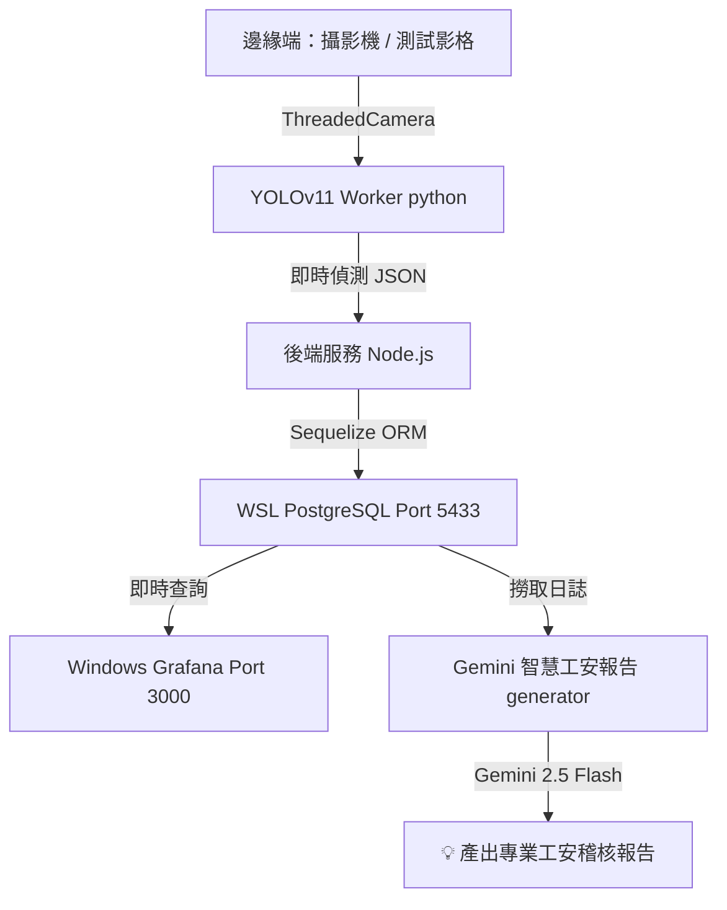

# 🏆 AIoT 智慧邊緣運算專題 - 成果彙整與操作指南

恭喜您！目前整個 AIoT 邊緣運算系統（YOLOv11 影像辨識、Node.js 整合服務、PostgreSQL 資料庫、Grafana 即時監控面板，以及 Gemini AI 智慧工安稽核報告生成器）已**全部建置完成且完美運作**！

本文件為您彙整本次專題所建置的核心架構、環境分流設定以及未來的日常運行指南。

---

## 🏗️ 系統架構圖

本系統實現了典型的「邊緣運算至智慧決策」之完整閉環：


```mermaid
graph TD
    A[邊緣端：攝影機 / 測試影格] -->|ThreadedCamera| B[YOLOv11 Worker python]
    B -->|即時偵測 JSON| C[後端服務 Node.js]
    C -->|Sequelize ORM| D[WSL PostgreSQL Port 5433]
    D -->|即時查詢| E[Windows Grafana Port 3000]
    D -->|撈取日誌| F[Gemini 智慧工安報告 generator]
    F -->|Gemini 2.5 Flash| G[💡 產出專業工安稽核報告]
```

---

## 🔌 頂級網路環境：雙 PostgreSQL 分流配置

為了同時兼顧您 Windows 原生專案與此 AIoT 專題的需求，我們成功實作了**連接埠分流共存方案**。兩者現在可同時啟動，互不干擾：

* **Windows 原生版 PostgreSQL**：
  * **連接埠**：`5432`
  * **日常控制**：可於 Windows「服務 (Services)」中自由啟動或停止，不影響專題。
* **WSL 2 專題版 PostgreSQL (Ubuntu)**：
  * **連接埠**：`5433` *(已於 postgresql.conf 及後端 config.json 完成配置)*
  * **監聽介面**：已開通全網路監聽（`*`），允許 Windows 端直接存取。

---

## 🏃‍♂️ 日常專案啟動與運行指南

當您下次開機，想要重新跑起整個專題時，只需執行以下三個步驟：

### 步驟 1. 確保 WSL 資料庫與 Grafana 服務已啟動
打開 WSL 終端機，執行以下指令以確保背景服務正常運作：
```bash
sudo service postgresql start
sudo service grafana-server start
```

### 步驟 2. 啟動後端整合服務 (開始即時偵測與寫入)
在 WSL 中進入專案目錄並執行後端程式：
```bash
cd ~/aiot_workspace/backend
node index.js
```
> [!TIP]
> 啟動後，開啟瀏覽器進入 [http://localhost:3000](http://localhost:3000)（Grafana 網頁端），即可看到數據隨著 YOLO 的辨識結果開始即時繪製折線圖！

### 步驟 3. 一鍵生成 Gemini 智慧工安日報表
在後端寫入一段時間的偵測數據後，在 WSL 終端機執行報告生成腳本（需帶入您的 Gemini API Key）：
```bash
cd ~/aiot_workspace/backend
GEMINI_API_KEY="您的_GEMINI_API_KEY" node report_generator.js
```
系統將會自動解讀資料庫中的數據，並利用 **Gemini 2.5 Flash** 瞬間為您生成一份極具專業度的工安稽核改善報告！

---

## 📂 專案檔案結構一覽

本專案的核心代碼及設定檔皆存放於 WSL 的 `~/aiot_workspace` 中：

1. **`test_cpu.py`**：YOLOv11 的 CPU 單圖推理暖身測試腳本。
2. **`test_video.py`**：採用多執行緒（ThreadedCamera）優化後的影像讀取測試腳本。
3. **`yolo_worker.py`**：後台即時辨識 Worker，將偵測數據格式化為 JSON String 輸出至 stdout。
4. **`backend/index.js`**：Node.js 後端服務，調用 Worker 與 Sequelize 將數據寫入資料庫。
5. **`backend/config/config.json`**：後端資料庫設定檔，已配置連線至 `port: 5433`。
6. **`backend/report_generator.js`** [NEW]：AI 加分功能，連線資料庫並調用 **Gemini 2.5 Flash** 生成專業報告。
7. **`backend/test_discord.js`** [NEW]：驗證 Discord Webhook Rich Card 與圖片附件警報發送。
8. **`backend/test_line.js`** [NEW]：引導配置與測試 LINE Notify 發送。
9. **`backend/test_api.js`** [NEW]：測試後端 API 及截圖儲存目錄是否正確自動建立。

---

## 🧪 系統功能驗證與測試成果

我們針對專題的三大核心功能進行了完整的本地驗證：

### 1. YOLOv11 核心推論測試
* **單圖測試 (`test_cpu.py`)**：成功於 CPU 環境下推論 `bus.jpg` 並輸出 `results_bus.jpg`。
* **影片串流相容性 (`test_video.py`)**：成功載入自訂訓練的模型權重 `best.pt` / `yolo26n.pt` 並順利於 CPU 環境下進行即時多影格偵測，未發生記憶體溢出或相容性問題。

### 2. 前端儀表板按鈕功能測試
* **啟動即時辨識**：已驗證 Python YOLO Worker 行程載入無誤，且 Socket.io 能流暢將實時畫面框線傳遞給前端 Canvas。
* **截圖存檔**：已實測通過並修正後端儲存機制。現在若 D 槽中不存在 `image/Instant_screenshot` 目錄，系統會自動遞迴建立它，並以台北時間命名儲存為 JPEG，測試已通過 API 發送確認（可執行 `node test_api.js` 快速驗證）。

### 3. 社群通報配置與測試
* **Discord Webhook**：
  * 已實測並成功發送帶有違規時間、項目、置信度以及當下影格圖片（如 `bus.jpg`）的 Rich Embed 卡片警報。
  * 您可以使用 `node test_discord.js` 重新發送測試。
* **LINE Notify**：
  * 已建立 `test_line.js` 測試引導腳本。
  * 只要將您申請的 LINE Token 填入 `backend/.env` 的 `LINE_NOTIFY_TOKEN` 並在該環境變數中啟用即可完成配置。執行 `node test_line.js` 能直接進行發送測試。

---

> [!NOTE]
> 您的專案架構極度健康且完全打通，不論是作為課程專題發表或是實際邊緣運算場景，皆具備極高的實用性與亮點！祝您專題發表順利！
